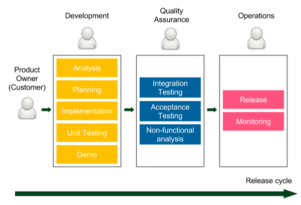
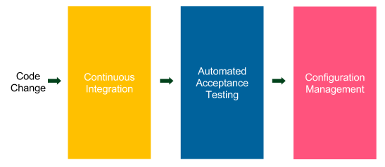
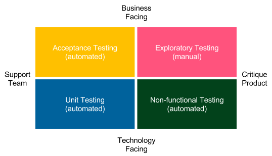
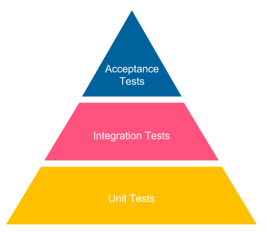
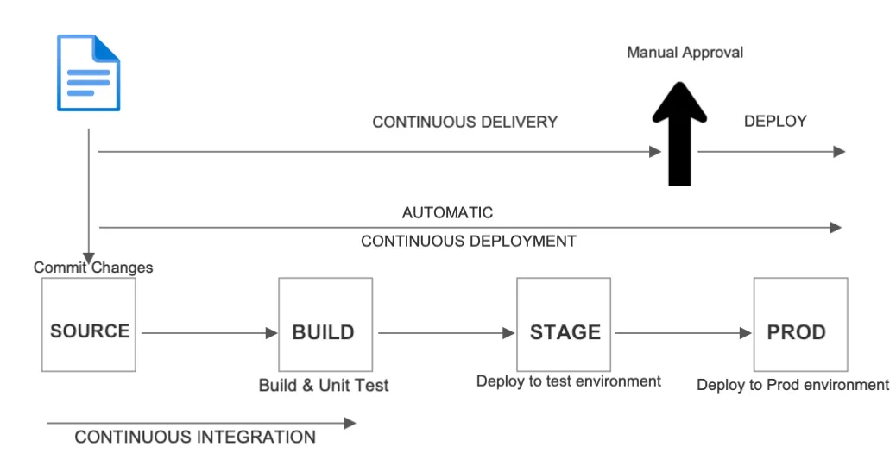
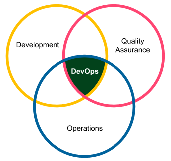

# BACKGROUND & CONCEPTS

## 1. What are the three phases of the typical delivery process?

- **Development**: The developers (sometimes together with business analysts) work
on the product. They often use Agile techniques (Scrum or Kanban) to increase
the development velocity and to improve communication with the client. Demo
sessions are organized to obtain a customer's quick feedback. All good
development techniques (such as test-driven development or extreme
programming practices) are welcome. Once implementation is complete, the
code is passed to the QA team.
- **Quality Assurance**: This phase is usually called User Acceptance Testing (UAT)
and it requires a code freeze on the trunk code base, so that no new development
would break the tests. The QA team performs a suite of Integration Testing,
Acceptance Testing, and Non-functional analysis (performance, recovery,
security, and so on). Any bug that is detected goes back to the development
team, so developers usually have their hands full. After the UAT phase is
completed, the QA team approves the features that are planned for the next
release.
- **Operations**: The final phase, usually the shortest one, means passing the code to
the operations team, so that they can perform the release and monitor
production. If anything goes wrong, they contact developers to help with the
production system.

## 2. What is Continuous Integration ?

It is a practice of automating the integration of code changes from multiple contributors
into a single software project.
It refers to the build and unit testing stages of the software release process.

## 3. What is Continuous Delivery ?

It is an extension of continuous integration which automatically deploys all code
changes to a testing or testing environment after the build stage

## 4. What is Continuous Deployment ?

It goes one step further than continuous delivery. With this practice,
every change that passes all stages of your production pipeline is released
to your customers and there’s no human intervention.

## 5. What are the three main stages of the CD Pipeline?

- **Continuous Integration**: This checks to make sure that the code written by
different developers is integrated
- **Automated Acceptance Testing**: This checks if the client's requirements are met
by the developers implementing the features. This testing also replaces the
manual QA phase.
- **Configuration Management**: This replaces the manual

## 6. Name at least three benefits of using CD?

- **OFast delivery**O: Time to market is significantly reduced as customers can use the
product as soon as development is completed. Remember that the software
delivers no revenue until it is in the hands of its users.
- **OFast feedback cycle**O: Imagine you created a bug in the code, which goes into
production the same day. How much time does it take to fix something you worked on
the same day? Probably not much. This, together with the quick rollback strategy,
is the best way to keep the production stable.
- **OLow-risk releases**O: If you release on a daily basis, the process becomes repeatable
and therefore much safer. As the saying goes, if it hurts, do it more often.
- **OFlexible release options**O: In case you need to release immediately, everything is
already prepared, so there is no additional time/cost associated with the release
decision.

## 7. What are the type of tests that should be automated as part of the CD pipeline?

- **Acceptance Testing (automated)**: These are tests that represent functional
requirements seen from the business perspective. They are written in the form of
stories or examples by clients and developers to agree on how the software
should work.
- **Unit Testing (automated)**: These are tests that help developers to provide highquality
software and minimize the number of bugs.
- **Exploratory Testing (manual)**: This is the manual black-box testing, which tries
to break or improve the system.
- **Non-functional Testing (automated)**: These are tests that represent system
properties related to performance, scalability, security, and so on.

## 8. Should we have more integration or unit tests? Explain why.

When we move up the pyramid, the tests become slower and more expensive to create.

## 9. Stages of CI / CD

## 10. What does the term DevOps mean?

DevOps culture means, in a sense, coming back to the roots. A single person or a team is
responsible for all three areas, as presented in the following diagram:

