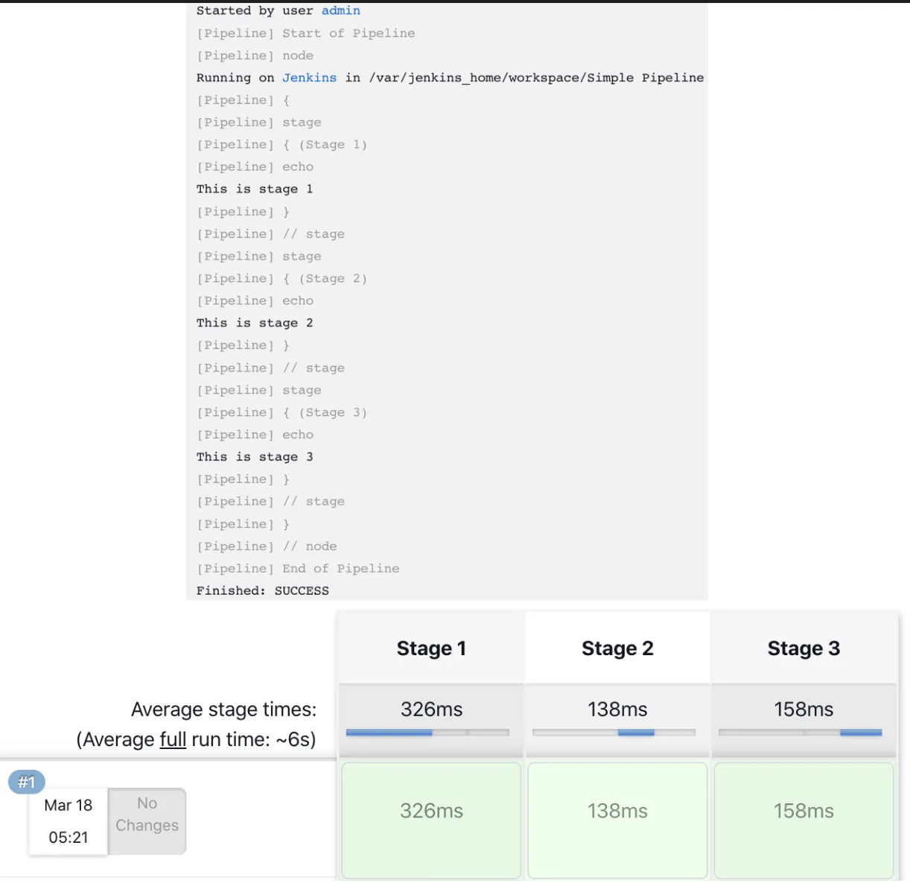
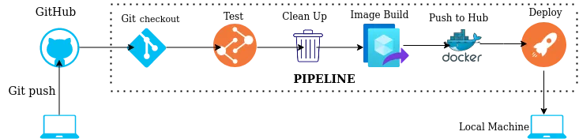
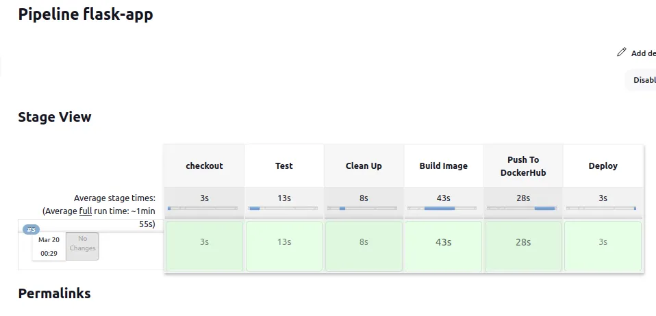
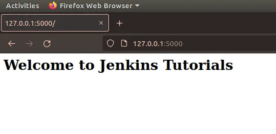

# What is Jenkins ?

It is an open source automation platform that helps to automate the parts of software development related to building, testing, and deploying, facilitating continuous integration and continuous delivery. It offers a simple way to set up a continuous integration (CI) and continuous delivery (CD) environment .

### Key Terminologies

- **Controller** - It is a central, coordinating process which stores configuration, loads plugins, and renders the various user interfaces for Jenkins.
- **Agent** - It is typically a machine or container which connects to a controller and executes tasks when directed by the controller.
- **Job** - It is a given set of tasks that runs sequentially as defined by the user.
- **Pipeline** - It is a collection of jobs which are interlinked with one another in a sequence
- **Stage** - It defines a conceptually distinct subset of tasks performed through the entire Pipeline
- **Step** - A single task
- **Jenkinsfile** - It is a text file that contains the definition of a Pipeline

*Sample Jenkinsfile*

```
pipeline {
    agent any
    stages {
        stage("Stage 1"){
            steps {
                echo "This is stage 1"
            }
        }
        stage("Stage 2"){
            steps {
                echo "This is stage 2"
            }
        }
        stage("Stage 3"){
            steps {
                echo "This is stage 3"
            }
        }
    }
}
```



## Getting Started

We will create a simple flask application and then implement the CI/CD for it.



1. **Installation**

- Install the library [flask](https://flask.palletsprojects.com/en/2.1.x/installation/), [pytest](https://pypi.org/project/pytest/)
- Download the [Jenkins](htps://www.jenkins.io/doc/book/installing/), [Docker](https://docs.docker.com/get-docker/)

2. **Jenkins Setup**

- Download required plugins — Docker pipeline (from dashboard Manage Jenkins -> Manage plugins)
- Add credentials for github and dockerhub using option Username with password ( from dashboard Manage Jenkins -> Manage credentials -> System (Global credentials) -> Add credentials). Make sure you remember the ID given to each credential , we will use the same in our jenkins pipeline script
- Set PATH variable on Jenkins same as the on the local machine that include module’s directory (from dashboard Manage Jenkins -> Configure System → Under Global Properties tick Environment variables and add name (PATH) , value)

3. **Code**

*app.py*

```
from flask import *

app = Flask(__name__)

@app.route('/')
def home():
    return "<h1>Welcome to Jenkins Tutorials<h1/>"

if __name__ == '__main__':
    app.run(debug=True,host='0.0.0.0'
```

*testRoutes.py*

```
from app import *

def test_Home():
    response = app.test_client().get('/')
    assert b"Welcome to Jenkins Tutorials" in response.data
    assert response.status_code == 200
```

*requirements.txt*

```
flask
Jinja2
pytest
```

*Dockerfile*

```
FROM python:3.8-slim-buster
WORKDIR /app
COPY . .
RUN pip install -r requirements.txt
CMD ["python","app.py"]
```

*Jenkinsfile*

```
def img
pipeline {
    environment {
        registry = "jvelloen/python-jenkins" //To push an image to Docker Hub, you must first name your local image using your Docker Hub username and the repository name that you created through Docker Hub on the web.
        registryCredential = 'DOCKERHUB'
        githubCredential = 'GITHUB'
        dockerImage = ''
    }
    agent any
    stages {
        
        stage('checkout') {
                steps {
                git branch: 'master',
                credentialsId: githubCredential,
                url: 'https://github.com/jvelloen/jenkins-cicd-lab.git'
                }
        }
        
        stage ('Test'){
                steps {
                    sh "cd flask_app"
                    sh "pytest testRoutes.py"
                }
        }
        
        stage ('Clean Up'){
            steps{
                sh returnStatus: true, script: 'docker stop $(docker ps -a | grep ${JOB_NAME} | awk \'{print $1}\')'
                sh returnStatus: true, script: 'docker rmi $(docker images | grep ${registry} | awk \'{print $3}\') --force' //this will delete all images
                sh returnStatus: true, script: 'docker rm ${JOB_NAME}'
            }
        }

        stage('Build Image') {
            steps {
                script {
                    img = registry + ":${env.BUILD_ID}"
                    println ("${img}")
                    dockerImage = docker.build("${img}")
                }
            }
        }

        stage('Push To DockerHub') {
            steps {
                script {
                    docker.withRegistry( 'https://registry.hub.docker.com ', registryCredential ) {
                        dockerImage.push()
                    }
                }
            }
        }
                    
        stage('Deploy') {
            steps {
                sh label: '', script: "docker run -d --name ${JOB_NAME} -p 5000:5000 ${img}"
            }
        }
    }
}
```

4. **Build Pipeline**

- Create a pipeline
- Paste the entire contents of JenkinsFile into pipeline script editor
- Save it and click on Build now


5. **Validation**



Image successfully pushed to DockerHub



## Conclusion

In this story, we have seen the basics of Jenkins and learnt how to implement Continuous Integration / Continuous Delivery using Jenkins for a Python application in five simple steps. Hope you have understood the basics of Jenkins

Thanks for reading!
