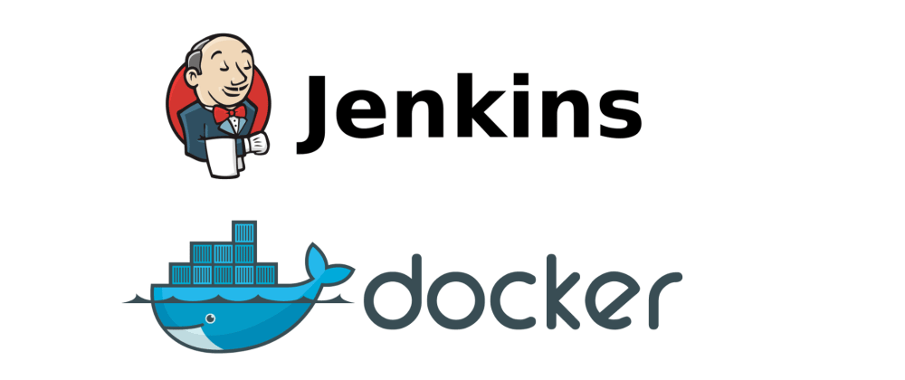

# Jenkins & Docker

## What is Jenkins ?

It is an open source automation platform that helps to automate the parts of software development related to building, testing, and deploying, facilitating continuous integration and continuous delivery. It offers a simple way to set up a continuous integration (CI) and continuous delivery (CD) environment.

## What is Docker ?

Docker provides the ability to package and run an application in a loosely isolated environment called a container. The isolation and security lets you to run many containers simultaneously on a given host. Containers are lightweight and contain everything needed to run the application, so you don't need to rely on what's installed on the host. You can share containers while you work, and be sure that everyone you share with gets the same container that works in the same way.

## What is Docker Compose ?

Docker Compose is a tool that helps you define and share multi-container applications. With Compose, you can create a YAML file to define the services and with a single command, you can spin everything up or tear it all down. It is used to define and run multi-container Docker applications. Compose works in all environments; production, staging, development, testing, as well as CI workflows. It also has commands for managing the whole lifecycle of your application: start, stop, and rebuild services; view the status of running services; stream the log output of running services; and run a one-off command on a service.

### Requirements:
- [Docker](https://docs.docker.com/get-docker/)